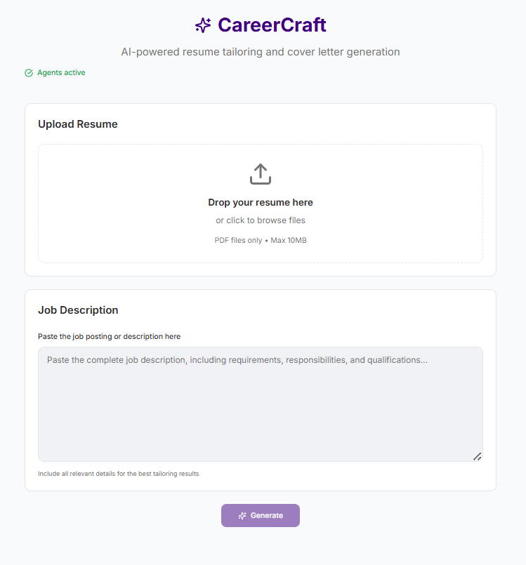
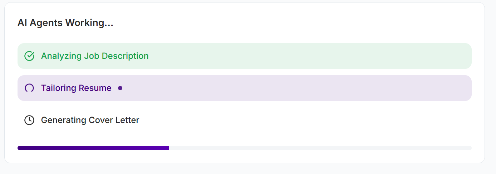
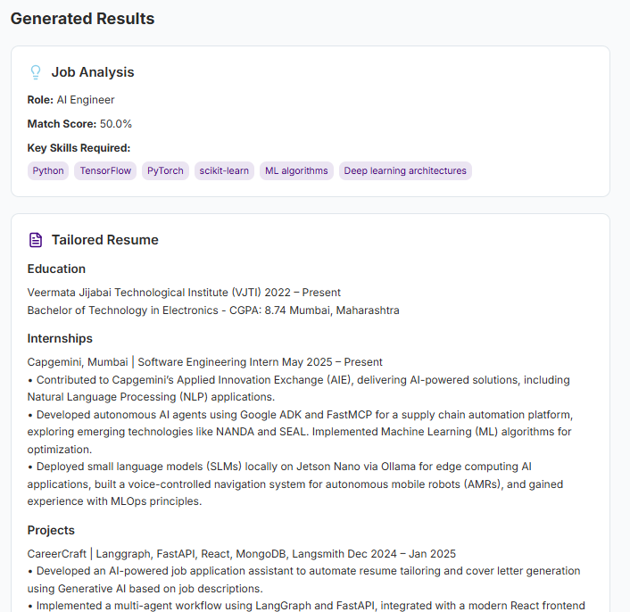
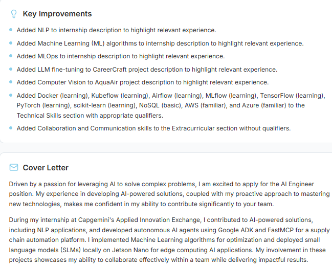

# CareerCraft 🚀

**AI-Powered Resume Tailoring and Cover Letter Generation Platform**

[](https://career-craft-nine.vercel.app/)
[](https://reactjs.org/)
[](https://fastapi.tiangolo.com/)
[](https://vercel.com/)

## 📖 Overview

CareerCraft is an intelligent career assistance platform that leverages AI to help job seekers create tailored resumes and compelling cover letters. By analyzing job descriptions and existing resumes, the platform provides personalized recommendations and generates optimized content to increase your chances of landing your dream job.

## 🌟 Key Features

### 🎯 Smart Resume Tailoring
- **AI-Powered Analysis**: Advanced job description parsing to identify key requirements
- **Intelligent Matching**: Automatically highlights relevant skills and experiences
- **ATS Optimization**: Ensures your resume passes Applicant Tracking Systems
- **Real-time Processing**: Live updates during the tailoring process

### 📝 Cover Letter Generation
- **Personalized Content**: Creates unique cover letters based on job requirements
- **Professional Tone**: Maintains appropriate language and formatting
- **Company-Specific**: Tailors content to match company culture and values

### 🔄 Multi-Agent Workflow
- **Job Description Analyzer**: Extracts key requirements and qualifications
- **Resume Tailor**: Optimizes resume content for specific positions
- **Cover Letter Generator**: Creates compelling cover letters
- **Progress Tracking**: Real-time status updates throughout the process

## 🖼️ Screenshots

### Main Interface
<!-- Add screenshot of the main CareerCraft interface -->


*The clean and intuitive main interface of CareerCraft*

### Processing Progress
<!-- Add screenshot of the progress indicator -->

*Real-time progress tracking with agent status updates*

### Generated Results
<!-- Add screenshot of generated results section -->




*Comprehensive results including tailored resume and cover letter*


## 🛠️ Tech Stack

### Frontend
- **Framework**: React 18 with TypeScript
- **Build Tool**: Vite
- **Styling**: Tailwind CSS with custom components
- **UI Components**: Radix UI primitives
- **State Management**: TanStack Query for server state
- **Routing**: React Router DOM
- **Icons**: Lucide React
- **Notifications**: Sonner for toast notifications

### Backend
- **Framework**: FastAPI (Python)
- **AI/ML**: LangChain + LangGraph for multi-agent workflows
- **LLM**: Google Gemini AI
- **Database**: MongoDB with Motor (async driver)
- **File Processing**: PyPDF2 for PDF parsing
- **Async Processing**: Server-Sent Events (SSE) for real-time updates

### Deployment & Infrastructure
- **Frontend Hosting**: Vercel
- **Backend Hosting**: Vercel Serverless Functions
- **Database**: MongoDB Atlas
- **Environment**: Production-ready with CORS configuration

## 🚀 Getting Started

### Prerequisites
- Node.js 18+ and npm/yarn
- Python 3.9+
- MongoDB database (local or Atlas)
- Google AI API key

### Frontend Setup

1. **Clone the repository**
   ```bash
   git clone <repository-url>
   cd "Resume agent/frontend/resume_agent_frontend"
   ```

2. **Install dependencies**
   ```bash
   npm install
   ```

3. **Configure environment variables**
   ```bash
   # Create .env file
   VITE_API_BASE_URL=https://career-craft-backend-ten.vercel.app
   ```

4. **Start development server**
   ```bash
   npm run dev
   ```

### Backend Setup

1. **Navigate to backend directory**
   ```bash
   cd "Resume agent/backend"
   ```

2. **Create virtual environment**
   ```bash
   python -m venv venv
   source venv/bin/activate  # On Windows: venv\Scripts\activate
   ```

3. **Install dependencies**
   ```bash
   pip install -r requirements.txt
   ```

4. **Configure environment variables**
   ```bash
   # Create .env file
   GOOGLE_API_KEY=your_google_ai_api_key
   MONGODB_URL=your_mongodb_connection_string
   ```

5. **Start the server**
   ```bash
   python run_server.py
   ```

## 📁 Project Structure

```
Resume agent/
├── frontend/
│   └── resume_agent_frontend/
│       ├── src/
│       │   ├── components/          # React components
│       │   │   ├── ui/             # Reusable UI components
│       │   │   ├── CareerCraft.tsx # Main application component
│       │   │   ├── ResumeUpload.tsx
│       │   │   ├── JobDescriptionInput.tsx
│       │   │   ├── ProgressIndicator.tsx
│       │   │   └── OutputSection.tsx
│       │   ├── hooks/              # Custom React hooks
│       │   ├── lib/                # Utility functions and API
│       │   ├── pages/              # Page components
│       │   └── types/              # TypeScript type definitions
│       ├── public/                 # Static assets
│       └── package.json
├── backend/
│   ├── app/
│   │   ├── workflow/               # LangGraph workflow implementation
│   │   │   ├── agents/            # Individual AI agents
│   │   │   ├── graph.py           # Workflow orchestration
│   │   │   └── models.py          # Pydantic models
│   │   ├── main.py                # FastAPI application
│   │   ├── database.py            # MongoDB integration
│   │   └── utils.py               # Utility functions
│   ├── requirements.txt
│   └── vercel.json                # Vercel deployment config
└── README.md
```

## 🔧 API Endpoints

### POST `/process-resume`
Processes uploaded resume and job description to generate tailored content.

**Parameters:**
- `resume_file`: PDF file (multipart/form-data)
- `job_description`: Job description text (minimum 50 characters)

**Response:** Server-Sent Events stream with real-time progress updates

### GET `/health`
Health check endpoint for service monitoring.

## 🎯 Usage Guide

1. **Upload Your Resume**: Drag and drop your PDF resume or click to browse
2. **Paste Job Description**: Copy the job posting and paste it into the text area
3. **Generate Content**: Click the "Generate" button to start the AI processing
4. **Monitor Progress**: Watch real-time updates as each agent processes your content
5. **Review Results**: Get your tailored resume and personalized cover letter
6. **Download**: Save the generated content for your job applications

## 🔒 Security & Privacy

- **File Security**: Uploaded files are processed in memory and not permanently stored
- **Data Privacy**: Personal information is handled securely and not shared
- **API Security**: CORS configured for secure cross-origin requests
- **Environment Variables**: Sensitive data stored securely in environment variables

## 🚀 Deployment

The application is deployed on Vercel with the following configuration:

- **Frontend**: Automatic deployment from main branch
- **Backend**: Serverless functions with Python runtime
- **Database**: MongoDB Atlas for production data storage
- **CDN**: Global edge network for optimal performance

**Live Application**: [https://career-craft-nine.vercel.app/](https://career-craft-nine.vercel.app/)

## 📝 License

This project is licensed under the MIT License - see the [LICENSE](LICENSE) file for details.

## 🙏 Acknowledgments

- **LangChain & LangGraph**: For the powerful AI workflow framework
- **Google AI**: For the Gemini language model
- **Vercel**: For seamless deployment and hosting
- **Radix UI**: For accessible UI components
- **Tailwind CSS**: For utility-first styling

## 📞 Support

For support, questions, or feedback:
- Create an issue in this repository
- Visit the live application: [CareerCraft](https://career-craft-nine.vercel.app/)

---

**Made with ❤️ for job seekers worldwide**
